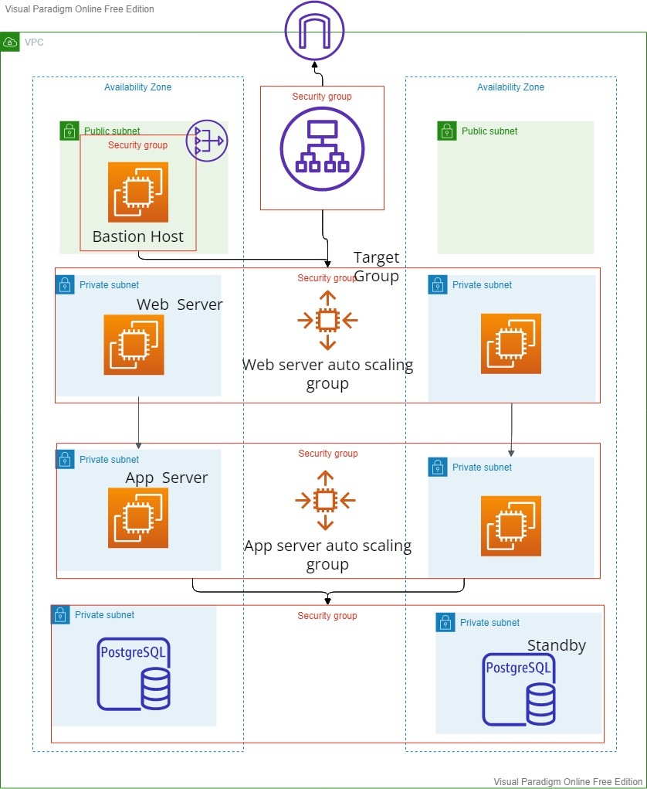

# DevOps-Project

The aim is to spin up infrastructure for a three-tier architecture consisting of an NGINX web-server, Java Apache Tomcat application server and Postgres Database Server on AWS.

Please find the Architecture diagram below:

As can be seen in the diagram above we have used

* A VPC in us-east-1 region
* Two Availability Zones - us-east-1a & use-east-1b
* A bastion host in public subnet to connect with app & web servers
* NAT gateway to allow internet access for web server
* Internet Gateway to allow resources in the VPC to access internet
* Internet facing Application Load Balancer which forwards traffic to web_server target group with is attached with an auto-scaling group too to scale if necessary
* EC2 instances for web and app servers (ECS or EKS could be used along with Docker in future if required)
* Auto-scaling group for app server too.
* RDS Postgresql DB and a Standby in us-east-1b AZ.
* Security groups for bastion, ALB, web servers, app servers & DB.

# Assumption/Constraints

* We haven't specified an environment in the terraform scripts. The whole infra is environment-agnostic for now.
* Very basic terraform features have been used
* The architecture is very basic and is not cost optimised

# How to Run?

0) Prequisites: An AWS IAM Role with all permissions required to create the services mentioned in the scripts; An EC2 Key Pair; `AWS_ACCESS_KEY_ID` and `AWS_SECRET_ACCESS_KEY` of the IAM role. Pass them as variables in steps 2 & 3.
1) Run `terraform init` in terminal in the root folder to initialize the root directory and download plugins in provider
2) Then run `terraform plan`to see the changes which will be made in AWS
3) `terraform apply` for to physically create the infrastructure
4) Application Load Balancer DNS is printed as an output. Hit it to check the application.
5) `terraform destroy` to destry everything

# Things to improve

1) Instead of manually running everything, we could configure Jenkins or Gitlab CI/CD pipeline to fetch the code and apply the terraform changes with required secrets (AWS Keys).
2) Use advanced features of terraform such as modules to improve code reusability.
3) We can use Route53 to map the ALB DNS to a better, readable domain name
4) Create different .tfvars files for dev, qa & prod to use 
5) Instead of EC2 servers we can containerize the application and use ECS or EKS.